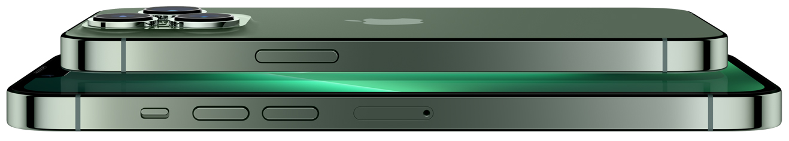

# iPhone 13 Pro — Clone da Landing Page

Clone da página de produto do iPhone 13 Pro da Apple, desenvolvido com HTML, CSS e JavaScript puro como projeto de estudo de desenvolvimento front-end.

## Demo



## Funcionalidades

- Seletor de cores interativo com 5 opções (Verde, Prata, Dourado, Grafite, Azul)
- Troca de imagem do produto ao selecionar a cor, com efeito de fade suave
- Layout responsivo adaptado para dispositivos móveis (breakpoint em 480px)
- Visual fiel ao design da Apple, com tipografia, cores e botões estilizados

## Tecnologias

- HTML5
- CSS3 (Flexbox, media queries, transições)
- JavaScript (vanilla, manipulação de DOM)

## Estrutura

```
clone_iphone_13/
├── index.html
├── css/
│   └── styles.css
├── js/
│   └── scripts.js
└── img/
    ├── logo_apple.svg
    ├── iphone_green.jpg
    ├── iphone_silver.jpg
    ├── iphone_golden.jpg
    ├── iphone_grafite.jpg
    └── iphone_blue.jpg
```

## Como rodar

Basta abrir o arquivo `index.html` no navegador — não há dependências externas.

## Aprendizados

- Estruturação semântica de HTML
- Estilização com CSS moderno (Flexbox, transições, variáveis visuais)
- Manipulação de DOM com JavaScript puro
- Responsividade com media queries
